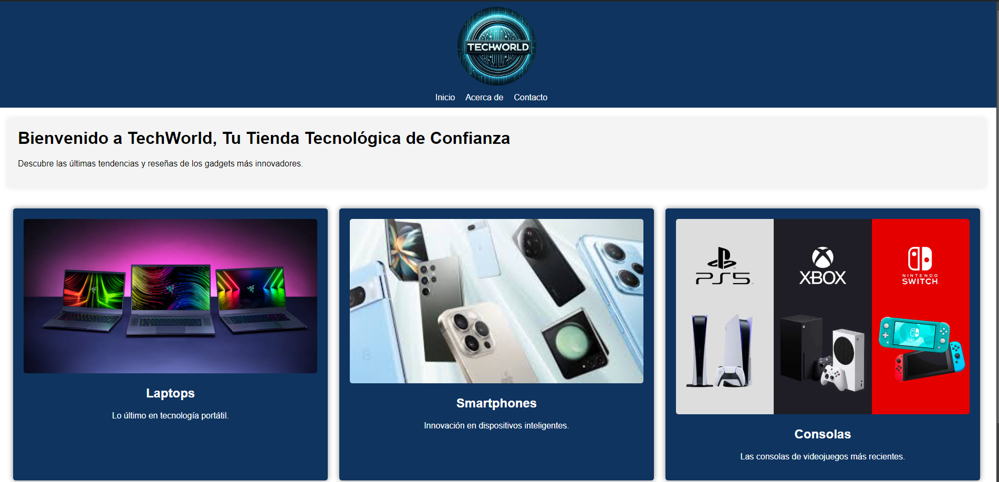
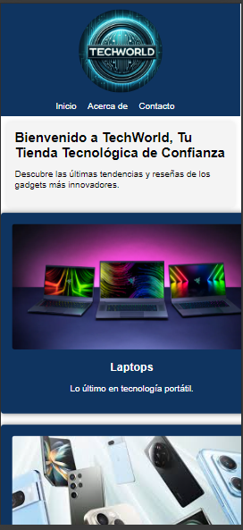

TechWorld - Página de Gadgets
Descripción del Proyecto
Este proyecto es una página web diseñada para una tienda de gadgets llamada TechWorld. El objetivo principal de la página es ofrecer una experiencia visual atractiva, moderna y fácil de navegar para los usuarios interesados en tecnología. 
La página incluye secciones que muestran información sobre la tienda, gadgets destacados, y un pie de página con enlaces a redes sociales.

El diseño está completamente optimizado para ser responsivo, adaptándose a diferentes dispositivos y tamaños de pantalla, asegurando que la experiencia de usuario sea fluida tanto en computadoras de escritorio como en dispositivos móviles.

Estructura del Proyecto
El proyecto está compuesto por los siguientes archivos principales:

index.html: Estructura HTML de la página web.
styles.css: Estilos y diseño de la página, incluyendo las reglas de diseño responsivo.
main.js: Archivo JavaScript que controla la interactividad de la página.
images/: Carpeta que contiene las imágenes usadas en la página (logo, gadgets, redes sociales).
Enfoque de Diseño Responsivo
El diseño responsivo de la página se implementa utilizando Media Queries en CSS, que permiten ajustar el diseño dependiendo del ancho de la pantalla. Los principales puntos de enfoque del diseño responsivo incluyen:

Encabezado flexible: El logo de la tienda se encuentra en la parte superior izquierda y los enlaces de navegación (Inicio, Acerca de, Contacto) se muestran a la izquierda. En pantallas más pequeñas, los elementos del encabezado se reorganizan verticalmente para asegurar una fácil lectura y acceso.

Tarjetas de Gadgets: Las tarjetas que muestran los gadgets más populares están diseñadas para mostrarse en una fila en pantallas grandes, y se ajustan a una columna en dispositivos móviles. Esto asegura que los gadgets se vean bien y sean fáciles de explorar, sin importar el tamaño de la pantalla.

Pie de Página con Redes Sociales: El pie de página está anclado en la parte inferior de la página y contiene enlaces a las redes sociales representadas por íconos redondeados. Estos íconos se ajustan en tamaño y disposición para adaptarse a pantallas más pequeñas.

Imágenes Redondeadas: Tanto el logo de la tienda como los íconos de redes sociales están redondeados, lo que aporta un estilo moderno y cohesivo a la interfaz.

Color y Estilo: La paleta de colores y los estilos de fuente están seleccionados para garantizar una buena legibilidad y contraste en diferentes dispositivos.

Instrucciones de Instalación
Para clonar y ejecutar este proyecto localmente:

Clona el repositorio:

bash
Copiar código
git clone https://github.com/tuusuario/techworld.git
Navega al directorio del proyecto:

bash
Copiar código
cd techworld
Abre el archivo index.html en tu navegador.

### Captura de Pantalla en Escritorio

### Captura de Pantalla en Móvil

### Captura de Pantalla en Ipad

Créditos
Este proyecto fue desarrollado por Armando Sierra. Si tienes preguntas o sugerencias, no dudes en contactarme a través de mis redes sociales.
